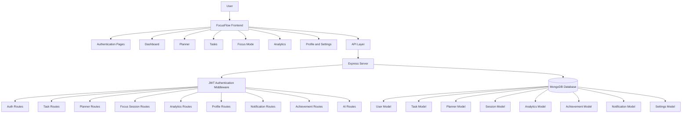

🚀 FocusFlow
AI-Powered Productivity & Study Planner
Focus Better. Study Smarter.
Developed by Pooja V
FocusFlow is a full-stack AI-powered productivity and study planner designed to help students, professionals, and creators manage their daily work with clarity and consistency. It brings together task management, planning, Pomodoro-based focus sessions, productivity analytics, gamification, and AI-assisted scheduling into one modern workspace.
The project was built to solve a common productivity problem: people often depend on multiple disconnected tools to manage tasks, calendars, timers, motivation, and progress tracking. FocusFlow simplifies that experience by providing one unified platform where users can plan their day, stay focused, track progress, and build better habits.
With a clean dashboard, beautiful UI, responsive design, dark mode, and future-ready backend architecture, FocusFlow is designed to feel like a premium SaaS productivity application while remaining practical, organized, and easy to extend.
📖 Overview
FocusFlow is an AI-powered productivity and study planner that helps users organize tasks, schedule study or work sessions, stay focused, and measure productivity over time. It is built for people who want more than a simple to-do list. FocusFlow combines planning, task management, focus sessions, analytics, and gamified motivation into one connected workspace.
Many productivity apps solve only one part of the problem. A user may need one app for tasks, another for calendar planning, another for Pomodoro timers, another for analytics, and another for habit tracking. This scattered workflow often creates friction and makes it harder to stay consistent. FocusFlow reduces that friction by combining these core productivity tools into a single experience.
The platform includes a smart dashboard, planner, task manager, focus mode, productivity charts, achievements, streaks, XP, coins, dark mode, and AI-powered productivity assistance. Students can use it to plan study sessions, track deadlines, and prepare for exams. Professionals can organize work blocks, manage priorities, and improve time management. Creators and freelancers can use it to stay consistent, reduce distractions, and track progress across projects.
FocusFlow was built with a modern full-stack architecture using HTML, CSS, JavaScript, Node.js, Express, MongoDB, and JWT authentication. Its frontend focuses on a premium user experience, while the backend provides a scalable foundation for authentication, tasks, planner data, focus sessions, analytics, notifications, achievements, and future AI integrations.
💡 Problem Statement
Staying productive is difficult when tasks, schedules, timers, reminders, and progress tracking are spread across multiple tools. Many users start with good intentions but lose consistency because their workflow becomes too complex. Switching between different apps can create distractions, reduce focus, and make it harder to understand what needs to be done next.
Common productivity challenges include:
Managing multiple productivity apps at the same time
Losing focus because of distractions and poor planning
Struggling with time management and task prioritization
Feeling unmotivated after long or inconsistent work sessions
Difficulty tracking progress over days, weeks, and months
Inconsistent study or work habits
Lack of clear feedback about productivity patterns
FocusFlow addresses these issues by combining essential productivity features into one unified platform. Users can create tasks, plan their day, start focus sessions, receive motivational feedback, track analytics, and earn rewards for consistency. AI-powered planning and productivity suggestions help users make smarter decisions about how to structure their time.
Instead of forcing users to build a productivity system from separate tools, FocusFlow provides a complete workspace that supports planning, execution, tracking, and habit building.
🚀 What Makes FocusFlow Unique?
FocusFlow is not just another task manager. It is designed as an all-in-one productivity platform that supports the entire workflow from planning to execution to reflection.
All-in-one productivity platform - Combines tasks, planner, focus mode, analytics, gamification, and profile management.
AI-powered planning - Provides smart scheduling, task prioritization, productivity suggestions, and study planning.
Gamified motivation - Uses XP, levels, coins, badges, streaks, daily challenges, and rewards to make consistency engaging.
Modern dashboard - Gives users a clear overview of focus score, study hours, completed tasks, pending tasks, and upcoming deadlines.
Personalized analytics - Helps users understand weekly progress, monthly trends, goal completion, and productivity patterns.
Beautiful user experience - Uses glassmorphism, gradients, premium spacing, rounded cards, and smooth interactions.
Responsive design - Works across desktop, tablet, and mobile screen sizes.
Dark mode - Supports a focused low-light experience.
Future-ready architecture - Built with modular frontend files, REST APIs, MongoDB schemas, protected routes, and scalable backend structure.
✨ Features
🎯 Smart Dashboard
The dashboard gives users a complete overview of their productivity day. It is designed to help users quickly understand what matters most and take action without feeling overwhelmed.
Key dashboard elements include:
Daily overview
Today’s date
Focus score
Study hours
Completed task summary
Pending task summary
Upcoming deadlines and sessions
Motivational quotes
AI productivity suggestions
Quick action buttons
Weekly progress chart
🍅 Focus Mode
Focus Mode helps users work or study in distraction-free sessions using Pomodoro-style timers. It supports both structured focus sessions and flexible custom sessions.
Focus Mode includes:
Pomodoro timer
25/5 and 50/10 presets
Custom focus sessions
Start, pause, resume, and reset controls
Ambient sound options
Session history
Focus statistics
Browser notifications
Fullscreen focus experience
This feature helps users build deep work habits and avoid unstructured study or work sessions.
📅 Planner
The planner helps users organize their schedule using daily, weekly, and monthly views. It supports time blocking so users can assign work to specific periods instead of leaving tasks floating in a list.
Planner features include:
Daily planner
Weekly planner
Monthly calendar
Time blocking
Drag-and-drop schedule blocks
Recurring tasks
Notes
Priority labels
Deadline reminders
Auto-save-ready structure
The planner is useful for students managing exams, professionals managing work blocks, and creators organizing project timelines.
✅ Task Management
FocusFlow includes a complete task management system for organizing work clearly and efficiently.
Task management includes:
Create tasks
Edit tasks
Delete tasks
Set priorities
Add categories
Add labels
Search tasks
Filter tasks
Sort tasks
Track progress
Checklist-ready structure
Attachment-ready UI
Tasks can be connected to planning, focus sessions, analytics, and productivity goals.
📊 Productivity Analytics
Analytics help users understand their productivity instead of guessing. FocusFlow turns activity into visual feedback so users can identify patterns and improve over time.
Analytics features include:
Productivity charts
Weekly progress
Monthly reports
Focus heatmaps
Study hour tracking
Task completion tracking
Goal tracking
Achievement charts
Productivity insights
Export report flow
These insights help users stay accountable and make better planning decisions.
🏆 Gamification
FocusFlow uses gamification to make productivity more motivating and consistent. Instead of relying only on discipline, users receive visual rewards for completing tasks and maintaining habits.
Gamification features include:
XP points
Levels
Coins
Badges
Streaks
Daily challenges
Weekly goals
Rewards
Unlockable themes
Leaderboard-ready backend
Gamification makes progress feel visible and encourages users to keep returning.
🤖 AI Productivity Assistant
The AI Productivity Assistant is designed to help users make smarter decisions about planning and prioritization.
AI features include:
Smart daily planning
Weekly planning support
Task prioritization
Productivity suggestions
Time estimation
Study planning
Smart schedule recommendations
Motivation and focus suggestions
The current backend includes AI-ready routes that can be extended with real AI model integration.
👤 User Profile
The profile section helps users track identity, achievements, and personal productivity statistics.
Profile features include:
User profile
Bio
Achievements
Current streak
Longest streak
XP points
Coins
Badges
Statistics
Settings
Theme preferences
Notification preferences
📸 Screenshots
Replace these placeholder image paths with real screenshots after capturing your project UI.

Landing Page

Dashboard

Planner

Focus Mode

Analytics

Profile

Dark Mode

🏗 System Architecture

⚙️ Tech Stack
Category	Technologies
Frontend	HTML5, CSS3, JavaScript ES6, Bootstrap 5
Backend	Node.js, Express.js
Database	MongoDB, Mongoose
Authentication	JWT, bcryptjs
Libraries	Chart.js, Font Awesome, Animate.css, AOS
Security	Helmet, CORS, Protected Routes
Deployment	Vercel for frontend, Render or Railway for backend
PWA	Manifest, Service Worker, Offline Shell

📂 Project Structure
FocusFlow/
├── index.html
├── login.html
├── register.html
├── dashboard.html
├── planner.html
├── focus.html
├── tasks.html
├── analytics.html
├── profile.html
├── settings.html
├── manifest.json
├── sw.js
├── package.json
├── README.md
├── LICENSE
├── .env.example
├── assets/
│   └── icon.svg
├── images/
│   └── focusflow-preview.png
├── css/
│   ├── style.css
│   ├── dashboard.css
│   ├── planner.css
│   ├── focus.css
│   ├── analytics.css
│   └── responsive.css
├── js/
│   ├── app.js
│   ├── api.js
│   ├── auth.js
│   ├── dashboard.js
│   ├── planner.js
│   ├── focus.js
│   └── analytics.js
└── server/
    ├── server.js
    ├── config/
    │   └── db.js
    ├── controllers/
    │   ├── authController.js
    │   ├── crudController.js
    │   └── aiController.js
    ├── middleware/
    │   └── auth.js
    ├── models/
    │   ├── User.js
    │   ├── Task.js
    │   ├── Planner.js
    │   ├── Session.js
    │   ├── Achievement.js
    │   ├── Notification.js
    │   ├── Settings.js
    │   └── Analytics.js
    └── routes/
        ├── authRoutes.js
        ├── tasksRoutes.js
        ├── plannerRoutes.js
        ├── sessionRoutes.js
        ├── analyticsRoutes.js
        ├── profileRoutes.js
        ├── notificationRoutes.js
        ├── achievementRoutes.js
        ├── settingsRoutes.js
        └── aiRoutes.js

📊 Project Statistics
Metric	Value
Project Type	Full Stack Web App
Frontend	HTML, CSS, JavaScript
Backend	Node.js + Express
Database	MongoDB
Authentication	JWT
Platform	Web
Deployment	Vercel + Render
UI Theme	Glassmorphism, Gradients, Dark Mode
Main Purpose	Productivity and Study Planning

🎯 Target Audience
FocusFlow is designed for users who want to stay organized, focused, and consistent.
Students can plan study sessions, manage assignments, track exam preparation, and build revision habits.
College learners can organize classes, deadlines, projects, and self-study schedules.
Professionals can manage priorities, schedule deep work, and track progress on important tasks.
Freelancers can organize client work, deadlines, focus sessions, and productivity goals.
Remote workers can structure workdays, avoid distractions, and maintain consistent routines.
Developers can use FocusFlow to plan coding sessions, track tasks, and manage project goals.
Content creators can schedule creative work, track progress, and stay motivated through gamification.
🧩 Challenges Addressed
FocusFlow addresses several common productivity challenges:
Procrastination
Disorganized schedules
Task overload
Poor planning
Lack of focus
Weak progress tracking
Inconsistent habits
Low motivation
Missed deadlines
Difficulty prioritizing tasks
By combining planning, task management, focus mode, analytics, and rewards, FocusFlow gives users a practical system for moving from intention to action.
🎯 Expected Impact
FocusFlow helps users build a stronger relationship with their time and attention. It encourages consistent planning, focused execution, and regular reflection.
Expected benefits include:
Better daily organization
Improved focus during study or work sessions
More consistent productivity habits
Clearer progress tracking
Better deadline management
Higher motivation through XP, badges, and streaks
Reduced dependence on multiple productivity tools
Better long-term habit building
FocusFlow is designed to help users stay consistent, improve productivity, build better habits, meet deadlines, and stay motivated.
🔮 Future Enhancements

AI chatbot for productivity coaching

Google Calendar sync

Voice assistant for commands and task creation

Team collaboration workspaces

Mobile app

Desktop app

Smart widgets

Offline-first database support

Real-time cloud sync

Advanced PDF reports

Habit templates

AI time estimation based on user behavior

Shared study groups

Wearable device integration
👨‍💻 Developer
Pooja V
Role: Developer, Designer, and Creator of FocusFlow
FocusFlow was created as a full-stack productivity project with a strong focus on clean UI, useful features, organized backend architecture, and a premium user experience. The goal of this project is to demonstrate how planning, focus, analytics, AI, and gamification can work together inside one modern web application.
🔗 Connect
Replace the placeholder links below with your real profiles before publishing.
Platform	Link
GitHub	https://github.com/your-username
LinkedIn	https://linkedin.com/in/your-profile
Portfolio	https://your-portfolio.com
Email	your.email@example.com

🤝 Contributing
Contributions are welcome. If you want to improve FocusFlow, follow these steps:
1. Fork the Repository
Click the Fork button on GitHub.
2. Create a New Branch
git checkout -b feature/your-feature-name
3. Make Your Changes
Improve UI, fix bugs, add features, update documentation, or enhance backend functionality.
4. Commit Your Changes
git add .
git commit -m "Add your meaningful commit message"
5. Push to Your Branch
git push origin feature/your-feature-name
6. Open a Pull Request
Submit a pull request with a clear explanation of what you changed and why.
📜 License
This project is licensed under the MIT License.
You are free to use, modify, and distribute this project for personal, educational, and commercial purposes.
❤️ Built with...
Built with ❤️ by Pooja V
Focus Better. Study Smarter.
